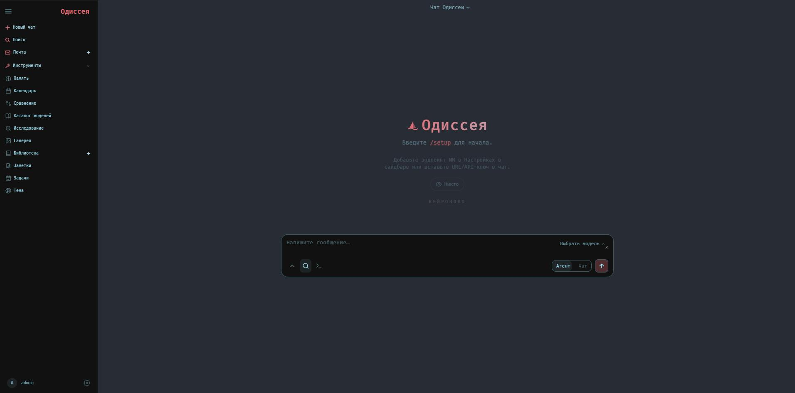

# Одиссея

```
───────────────────────────────────────────────
 ⊹ ࣪ ˖ ૮( ˶ᵔ ᵕ ᵔ˶ )っ  Одиссея · Нейроново
───────────────────────────────────────────────
```

 

Self-hosted AI-рабочее пространство — то же удобство, что и в ChatGPT с Claude, но на вашем железе, с вашими данными. Без облаков, без слежки, без лишнего.

## Возможности
  - **Чат** — общайтесь с любой локальной моделью или через API; подключить — проще простого.<br>　<sub>vLLM · llama.cpp · Ollama · OpenRouter · OpenAI</sub>
  - **Агент** — дайте ему инструменты и пусть сам решает задачу целиком.<br>　<sub>на базе [opencode](https://github.com/anomalyco/opencode) · MCP · веб · файлы · оболочка · навыки · память</sub>
  - **Каталог моделей** — сканирует ваше железо, рекомендует модели, скачивает и запускает в один клик.<br>　<sub>на базе [llmfit](https://github.com/AlexsJones/llmfit) · VRAM-aware · GGUF / FP8 / AWQ · оценка подходимости · vLLM / llama.cpp</sub>
  - **Глубокое исследование** — многошаговый поиск с чтением источников и синтезом в красивый отчёт.<br>　<sub>адаптировано из [Tongyi DeepResearch](https://github.com/Alibaba-NLP/DeepResearch)</sub>
  - **Сравнение** — сравнивайте модели бок о бок. Слепой тест — без предвзятости!<br>　<sub>мультимодельный · слепое тестирование · синтез</sub>
  - **Документы** — ВАМИ пишется текст, ИИ лишь помогает — не наоборот.<br>　<sub>многовкладочный редактор · Markdown · HTML · CSV · подсветка синтаксиса · правки ИИ · подсказки</sub>
  - **Память / навыки** — постоянная память и навыки; агент развивается, всё лучше понимая вас и ваши задачи.<br>　<sub>ChromaDB · fastembed (ONNX) · векторный + ключевой поиск · импорт/экспорт</sub>
  - **Почта** — IMAP/SMTP-ящик со встроенной ИИ-сортировкой: напоминания о важных письмах, автотеги, авторезюме, авточерновики ответов, антиспам.<br>　<sub>IMAP · SMTP · раздельная маршрутизация по аккаунтам · CalDAV</sub>
  - **Заметки и задачи** — быстрые заметки с напоминаниями, список дел и плановые задачи, которые агент может выполнять сам.<br>　<sub>пинги заметок · чеклисты · cron-задачи · ntfy / браузер / email</sub>
  - **Календарь** — локальный календарь с CalDAV-синхронизацией (Radicale / Nextcloud / Apple / Fastmail).<br>　<sub>CalDAV · импорт/экспорт .ics · цвета на каждый календарь · интеграция с агентом</sub>
  - **Работает на мобильных** — отлично выглядит и работает на телефоне, не только на десктопе.<br>　<sub>адаптивный · устанавливаемый (PWA) · жесты</sub>
  - **Дополнительно** — есть что изучить, попробуйте!<br>　<sub>редактор изображений · редактор тем · загрузка файлов (vision + PDF) · веб-поиск · пресеты · сессии · 2FA</sub>

## Демо
Полный интерактивный тур (наведи — воспроизвести) живёт на лендинге (`docs/index.html`).

<details>
<summary>Скриншоты и записи</summary>

### Чат и агенты

### Глубокое исследование

### Сравнение

### Документы

### Заметки и задачи


</details>

## Быстрый старт

Настройки по умолчанию работают сразу: клонируйте, запустите, затем настройте модели, поиск и почту в разделе **Настройки**. `.env` редактируйте только для параметров уровня развёртывания: `APP_BIND`, `APP_PORT`, `AUTH_ENABLED`, `DATABASE_URL` или учётные данные администратора.

**Первый вход:** на **Windows** при интерактивном `setup.py` в консоли задаёте **имя пользователя** и **пароль**; в **Docker** (и без TTY) — временный пароль в `docker compose logs odysseus` или заранее через `ODYSSEUS_ADMIN_USER` / `ODYSSEUS_ADMIN_PASSWORD` в `.env`. После входа смените пароль в **Настройках**, если нужно.

**Установка:** [Windows](#windows-нативно) · [Docker](#docker-рекомендуется) · [Linux / macOS](#linux--macos-нативно) · [Apple Silicon](#apple-silicon)

Хотите участвовать в разработке? Смотрите [CONTRIBUTING.md](CONTRIBUTING.md) — инструкции по настройке, тестированию и оформлению pull request.

### Windows (нативно)

1. Установите [Python 3.11+](https://www.python.org/downloads/) (галочка **Add python.exe to PATH**).
2. `git clone https://github.com/neuronovo-X/odysseus.git` → откройте папку `odysseus`.
3. Дважды щёлкните **`Запустить.bat`** (то же, что `launch-windows.ps1`: venv, зависимости, setup, сервер).
4. При **первом** запуске в консоли задайте **логин** (по умолчанию `admin`) и **пароль** (дважды). Откройте **http://127.0.0.1:7000** — браузер может открыться сам. Повторный запуск не переспрашивает, если учётка уже есть.

<details>
<summary>Windows — PowerShell и ручная установка</summary>

```powershell
git clone https://github.com/neuronovo-X/odysseus.git
cd odysseus
powershell -ExecutionPolicy Bypass -File .\launch-windows.ps1
```

Или вручную: `py -3.11 -m venv venv` → `venv\Scripts\Activate.ps1` → `pip install -r requirements.txt` → `python setup.py` → `python -m uvicorn app:app --host 127.0.0.1 --port 7000`.

**Требования:** Python 3.11+; для **Каталога** и shell-агента — [Git for Windows](https://git-scm.com/download/win). Локальный GPU (vLLM/SGLang) — через WSL2; проще [Ollama](https://ollama.com/download) → `http://localhost:11434/v1` в Настройках.

</details>

### Docker (рекомендуется)
```bash
git clone https://github.com/neuronovo-X/odysseus.git
cd odysseus
cp .env.example .env       # необязательно, но рекомендуется для явных дефолтов
docker compose up -d --build
```
Откройте `http://localhost:7000` когда контейнеры перейдут в статус healthy. Docker Compose по умолчанию привязывает веб-интерфейс к `127.0.0.1`. Если порт занят, установите `APP_PORT=7001` в `.env` и пересоздайте контейнер. `APP_BIND=0.0.0.0` — только если намеренно нужен доступ из локальной сети или через обратный прокси.

### Linux / macOS (нативно)
```bash
git clone https://github.com/neuronovo-X/odysseus.git
cd odysseus
python3 -m venv venv
source venv/bin/activate
pip install -r requirements.txt
python setup.py
python -m uvicorn app:app --host 127.0.0.1 --port 7000
```
Требования: Python 3.11+. Для Каталога моделей нужен `tmux` — фоновая загрузка и запуск. Само приложение лёгкое; тяжёлая часть — локальный запуск моделей; небольшие машины могут подключаться к API или удалённым серверам. `--host 0.0.0.0` — только при намеренном открытии LAN/прокси-доступа.

### Apple Silicon
Docker на macOS не может использовать Metal GPU. Для GPU-ускоренного Каталога моделей на Mac M-серии запускайте нативно:

```bash
git clone https://github.com/neuronovo-X/odysseus.git
cd odysseus
./start-macos.sh
```

Запускается на `http://127.0.0.1:7860`. Чтобы открыть доступ с телефона по доверенной локальной сети / VPN (например, Tailscale):

```bash
ODYSSEUS_HOST=0.0.0.0 ./start-macos.sh
# затем откройте http://<tailscale-ip>:7860
```

Скрипт читает `.env` при запуске, поэтому `APP_BIND=0.0.0.0` и `APP_PORT` из него подхватываются автоматически.

Держите `AUTH_ENABLED=true` (по умолчанию) до привязки вне loopback. Не открывайте порт напрямую в публичный интернет. Для сборки приложения-обёртки:

```bash
./build-macos-app.sh
```

<details>
<summary>Каталог моделей, GPU, Ollama и устранение проблем</summary>

**Встроенные сервисы Docker.** Compose запускает Одиссею, ChromaDB, SearXNG и ntfy. По умолчанию Одиссея и сервисы привязаны к `127.0.0.1` — доступны с хоста, но не из локальной сети / интернета без явного включения.

**Хранилище Каталога в Docker.** Загруженные модели хранятся в `./data/huggingface` (`~/.cache/huggingface` внутри контейнера). CLI и движки запуска — в `./data/local` (`~/.local`), и переживают пересоздание контейнера.

**Удалённые серверы.** В **Каталог → Настройки → Серверы** сгенерируйте SSH-ключ Одиссеи и добавьте публичный ключ в `~/.ssh/authorized_keys` удалённого сервера. С хоста можно также выполнить:

```bash
ssh-copy-id -i data/ssh/id_ed25519.pub user@server
```

**GPU-оверлеи в Docker.** Пользователи CPU могут пропустить этот раздел. Каталог видит только те GPU, которые Docker пробрасывает в контейнер — если runtime хоста или passthrough не настроены, Каталог увидит iGPU, другую карту или CPU вместо нужной.

Для NVIDIA скрипт `scripts/check-docker-gpu.sh` диагностирует passthrough и опционально устанавливает runtime или обновляет `.env`.

```bash
# Только диагностика (ничего не устанавливает, .env не меняет):
scripts/check-docker-gpu.sh

# Вывести команды установки без выполнения:
scripts/check-docker-gpu.sh --print-install-commands

# Установить NVIDIA Container Toolkit на Ubuntu/Debian (требует sudo):
scripts/check-docker-gpu.sh --install-nvidia-toolkit

# Записать COMPOSE_FILE в .env (только при подтверждённом GPU passthrough):
scripts/check-docker-gpu.sh --enable-nvidia-overlay

# Полная автонастройка — установить toolkit, затем включить оверлей:
scripts/check-docker-gpu.sh --install-nvidia-toolkit --enable-nvidia-overlay
```

Примечания по безопасности:
- Приложение никогда не устанавливает GPU runtime на хосте автоматически.
- Приложение никогда не редактирует `.env` автоматически.
- `.env` изменяется только при явной передаче `--enable-nvidia-overlay` и только после успешной проверки passthrough. `--yes` пропускает подтверждения, но не обходит проверку.
- Резервные копии `.env.bak.*` игнорируются Git и Docker build context.

Включить вручную без скрипта — добавьте в `.env`:

```bash
COMPOSE_FILE=docker-compose.yml:docker/gpu.nvidia.yml
```

**AMD / ROCm.** Диагностика только для чтения, `.env` — вручную. Выполните:

```bash
scripts/check-docker-amd-gpu.sh
```

Затем добавьте в `.env`, заменив `RENDER_GID` на числовой id группы render вашего хоста:

```bash
COMPOSE_FILE=docker-compose.yml:docker/gpu.amd.yml
RENDER_GID=989
```

Для поддержки NVIDIA/AMD GPU прочтите также комментарии в выбранном оверлей-файле: `docker/gpu.nvidia.yml` или `docker/gpu.amd.yml`.

Проверка после включения оверлея:

```bash
docker compose exec odysseus nvidia-smi -L   # NVIDIA
docker compose exec odysseus sh -lc 'test -e /dev/kfd && test -d /dev/dri && ls -l /dev/kfd /dev/dri/renderD*'  # AMD
```

> **GPU passthrough ≠ CUDA в llama.cpp.** То, что `nvidia-smi` работает внутри контейнера, подтверждает доступ Docker к GPU, но llama.cpp также требует `cudart` и CUDA Toolkit в runtime. Если в логах Каталога видно `Unable to find cudart library`, `Could NOT find CUDAToolkit` или тензоры/слои на CPU — это проблема сборки Каталога/llama.cpp, а не passthrough. Переустановите движок через **Каталог → Зависимости**, чтобы получить сборку с CUDA.
>
> То же самое для AMD/ROCm: наличие `/dev/kfd` и `/dev/dri` внутри контейнера подтверждает проброс устройств, но не userspace ROCm и не сборку vLLM/llama.cpp с ROCm. `rocm-smi` и `rocminfo` не ожидаются внутри образа Одиссеи.

**Ollama с Docker.** Если Ollama запущена на хосте, добавьте этот эндпоинт в Настройках:

```text
http://host.docker.internal:11434/v1
```

Ollama должна слушать вне своего loopback-интерфейса:

```bash
OLLAMA_HOST=0.0.0.0:11434 ollama serve
```

**Полезные команды.**

```bash
docker compose ps
docker compose logs --tail=120 odysseus
docker compose logs odysseus | grep -E 'ChromaDB|MemoryVectorStore|DEGRADED'
```

**macOS — детали.** `start-macos.sh` устанавливает зависимости Homebrew, создаёт venv, запускает setup и стартует uvicorn на порту `7860` (AirPlay часто занимает `7000`). Использует llama.cpp/Ollama для Metal. vLLM/SGLang требуют CUDA/ROCm и не работают на macOS. MLX-only модели Одиссеей не обслуживаются.

</details>

## Безопасность
Одиссея — это self-hosted рабочее пространство с мощными локальными инструментами: доступ к оболочке, загрузка файлов, скачивание моделей, веб-поиск, интеграции почты/календаря, API-токены. Обращайтесь с ней как с консолью администратора.

- Держите `AUTH_ENABLED=true` для любого сетевого развёртывания.
- Держите `LOCALHOST_BYPASS=false` вне локальной разработки.
- Используйте `SECURE_COOKIES=true`, когда Одиссея обслуживается через HTTPS доверенным обратным прокси или шлюзом.
- Не открывайте доступ напрямую в публичный интернет без HTTPS и доверенного прокси.
- Держите `.env`, `data/`, `logs/`, базы данных, загрузки, медиафайлы, резервные копии, файлы auth/сессий, API-ключи и токены провайдеров вне Git и публичных ресурсов. По умолчанию они игнорируются.
- Проверьте `data/auth.json` после первого запуска: отключите открытую регистрацию, если она не нужна; сделайте администратором только свой аккаунт; держите демо/тестовые аккаунты без прав администратора.
- Не-администраторы по умолчанию не имеют доступа к оболочке/Python/файлам, а маршруты и инструменты только для администраторов (управление MCP, API-токены, вебхуки, запуск моделей, резервное копирование, настройки приложения) требуют прав. Остальные функции контролируются привилегиями пользователя — проверьте их перед открытием доступа.
- Ротируйте API-ключи и токены, которые когда-либо попадали в публичный чат, демо, скриншот или лог.
- При использовании API-токенов или вебхуков создавайте отдельный токен для каждой интеграции и удаляйте неиспользуемые.
- Для ручного запуска разработки используйте `127.0.0.1`; `0.0.0.0` — только при намеренном открытии LAN/прокси-доступа.
- Держите ChromaDB, SearXNG, ntfy, Ollama, vLLM, llama.cpp, базы данных и API моделей/провайдеров только для внутреннего использования. Через доверенный прокси или шлюз открывайте только аутентифицированный веб/API-эндпоинт Одиссеи.
- Перед публикацией форка выполните `git status --short` и убедитесь, что файлы из `.env`, `data/`, `logs/`, загрузки, резервные копии и локальные базы данных не попали в индекс.

### Частное или проксированное развёртывание
Одиссея отдаёт простой HTTP на своём порту. Docker Compose по умолчанию привязывает Одиссею и сервисы к `127.0.0.1`, поэтому типовая схема продакшена:

1. Держите Одиссею на localhost, например `127.0.0.1:7000`.
2. Завершайте HTTPS на доверенном обратном прокси или шлюзе.
3. Разместите аутентифицированный веб/API-эндпоинт Одиссеи за этим слоем.
4. Держите порты сервисов и моделей только для внутреннего использования.

Cloudflare Access, Tailscale, Caddy, nginx, Traefik — все подходят под эту схему; ни один из них не обязателен. Если ваш шлюз достигает Одиссеи на том же хосте, проксируйте на `http://127.0.0.1:7000` и держите `AUTH_ENABLED=true`, `LOCALHOST_BYPASS=false` и `SECURE_COOKIES=true`.

Стандартные внутренние порты (конфигурация по умолчанию):

| Порт | Сервис |
|---|---|
| `7000` | Одиссея (app port) |
| `8080` | SearXNG |
| `8091` | ntfy |
| `8100` | ChromaDB (хост, ручной/compose-доступ) |
| `11434` | Ollama |
| `8000–8020` | Типовые API локальных моделей |

## Участие в разработке
Помощь приветствуется. Лучшие точки входа: тестирование чистой установки, баги подключения провайдеров, полировка мобильного/редактора, документация и небольшие сфокусированные рефакторинги. Актуальный список задач — в [ROADMAP.md](ROADMAP.md).

## Конфигурация
Большинство настроек выполняется внутри приложения через `/setup` или **Настройки**. Используйте `.env` для параметров уровня развёртывания и секретов, нужных до первого запуска.

| Переменная | По умолчанию | Описание |
|---|---|---|
| `LLM_HOST` | `localhost` | Адрес LLM-сервера (например `llm-host.local:8000`) |
| `LLM_HOSTS` | — | Список через запятую для обнаружения моделей |
| `OPENAI_API_KEY` | — | Опциональный ключ OpenAI. Предпочтительно добавлять провайдеров в приложении. |
| `SEARXNG_INSTANCE` | `http://localhost:8080` | URL SearXNG. Docker подставляет `http://searxng:8080`. |
| `SEARXNG_SECRET` | генерируется при первом Docker-запуске | Опциональный секрет cookie/CSRF для SearXNG. |
| `APP_BIND` | `127.0.0.1` | Адрес привязки Docker Compose для веб-интерфейса. |
| `APP_PORT` | `7000` | Порт Docker Compose для веб-интерфейса. |
| `AUTH_ENABLED` | `true` | Включить/отключить аутентификацию |
| `LOCALHOST_BYPASS` | `false` | Обход аутентификации для loopback (только разработка). |
| `SECURE_COOKIES` | `false` | `true` при HTTPS через доверенный прокси. |
| `DATABASE_URL` | `sqlite:///./data/app.db` | Строка подключения к базе данных |
| `CHROMADB_HOST` | `localhost` | Хост ChromaDB. Docker подставляет `chromadb`. |
| `CHROMADB_PORT` | `8100` | Порт ChromaDB для ручного запуска. Docker подставляет `8000`. |
| `EMBEDDING_URL` | — | OpenAI-совместимый эндпоинт эмбеддингов |

### Встроенные MCP-серверы (опциональная настройка)

Одиссея автоматически регистрирует несколько встроенных MCP-серверов при запуске. Серверы на базе npx (в частности, браузерный сервер `@playwright/mcp`) стартуют только если пакет уже есть в кэше npx. Если пакета нет — сервер пропускается с пояснительным сообщением в логе, так что свежая установка не зависает из-за загрузки npm.

Чтобы включить браузерный MCP (навигация, скриншоты, vision), выполните однократно:

```bash
npx -y @playwright/mcp@latest --version
```

Это установит `@playwright/mcp` и Playwright (~300 МБ суммарно). Перезапустите Одиссею — сервер зарегистрируется автоматически.

## Архитектура
```
app.py                   # точка входа FastAPI
core/      авторизация, база данных, middleware, константы
src/       llm_core, agent_loop, agent_tools, chat_processor, search/
routes/    chat, session, document, memory, model … эндпоинты
services/  docs, memory, search, hwfit (Каталог) …
static/    index.html + app.js + style.css + js/ (модульный фронтенд)
docs/      лендинг (index.html) + превью-записи
```

## Данные
Все пользовательские данные хранятся в `data/` (в .gitignore): `app.db` (сессии, сообщения, документы), `memory.json`, `presets.json`, `uploads/`, `personal_docs/`, `chroma/`, `settings.json`.

## Лицензия
MIT — см. [LICENSE](LICENSE) и [ACKNOWLEDGMENTS.md](ACKNOWLEDGMENTS.md).

```
                                  |
                                 |||
                                |||||
                  |    |    |   |||||||
                 )_)  )_)  )_)   ~|~
                )___))___))___)\  |
               )____)____)_____)\\|
             _____|____|____|_____\\\__
             \                       /
       ~^~^~~^~^~~^~^~~^~^~~^~^~~^~^~~^~^~~^~^~
               ~^~  все на борт!  ~^~
       ~^~^~~^~^~~^~^~~^~^~~^~^~~^~^~~^~^~~^~^~
```
